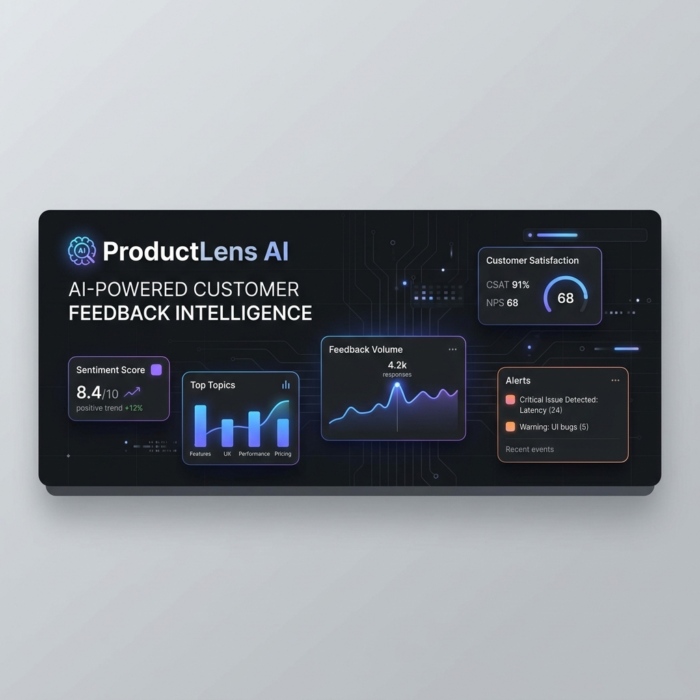
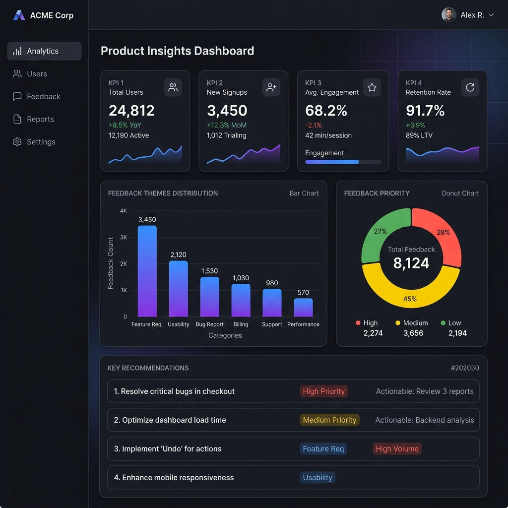
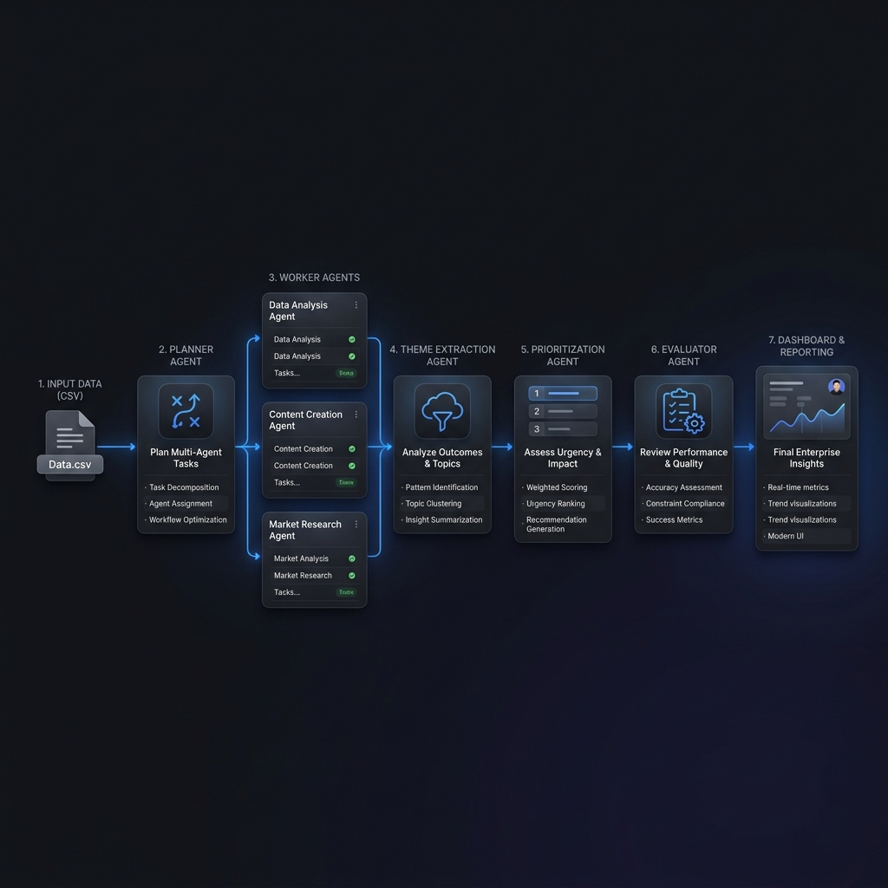
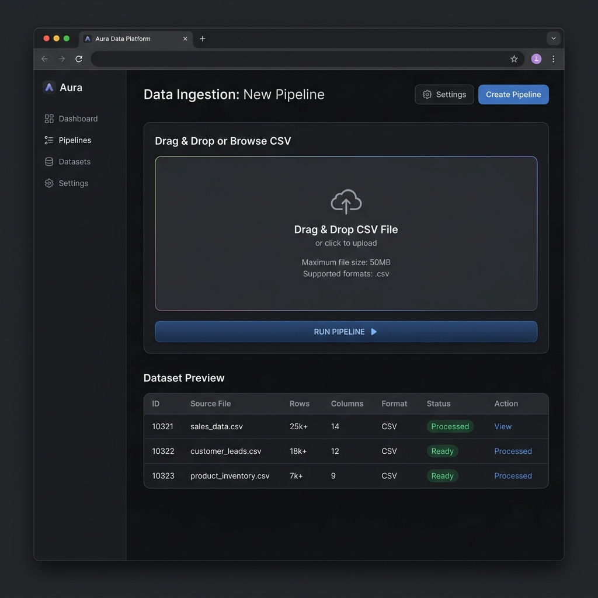
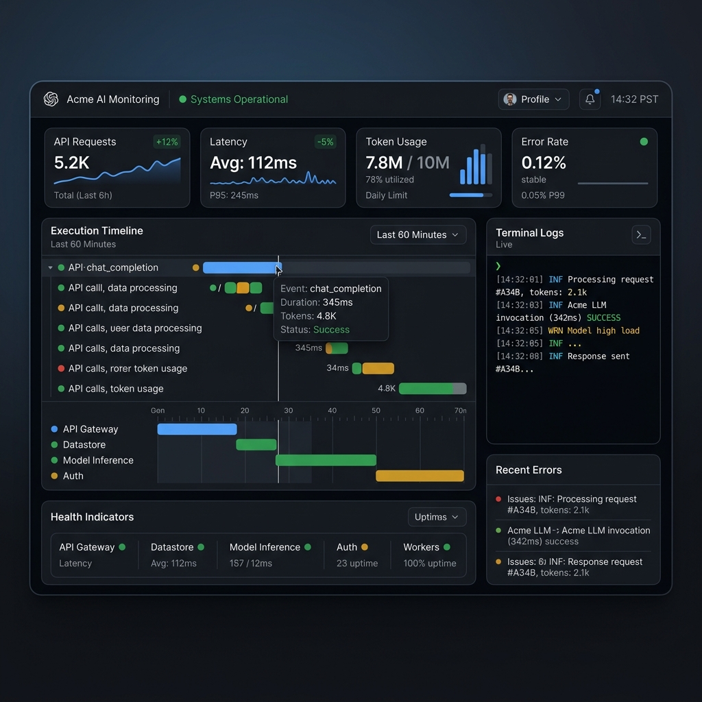
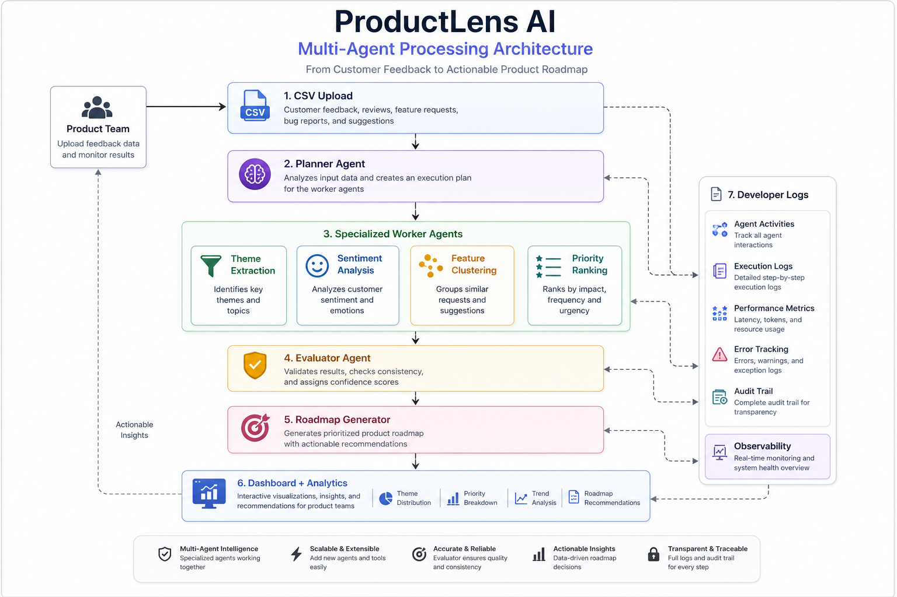

<div align="center">



<br />

# 🚀 ProductLens AI

**AI-Powered Customer Feedback Intelligence Platform**


</div>

---

## 🌟 Overview

ProductLens AI analyzes customer feedback through a specialized multi-agent system. It uses a Planner Agent and Worker Agents to process feedback, prioritizes themes based on user data, and generates product roadmap recommendations. The insights are intelligently analyzed using Google Gemini and visualized in a Gradio dashboard.

---

## 📸 Dashboard Preview

<div align="center">
  <table>
    <tr>
      <td align="center"><b>Dashboard</b></td>
      <td align="center"><b>Pipeline Execution</b></td>
    </tr>
    <tr>
      <td></td>
      <td></td>
    </tr>
    <tr>
      <td align="center"><b>Data Ingestion</b></td>
      <td align="center"><b>Observability Logs</b></td>
    </tr>
    <tr>
      <td></td>
      <td></td>
    </tr>
  </table>
</div>

---

## 🏗️ Architecture

The processing pipeline leverages an intelligent orchestration model where specialized agents collaborate to analyze data:


<div align="center">
  
</div>

---

## ⚙️ Project Workflow

1. **CSV Upload**
2. **Planner Agent**
3. **Worker Agents**
4. **Theme Extraction**
5. **Prioritization**
6. **Evaluator**
7. **Dashboard**
8. **Recommendations**

---

## 💻 Technology Stack

| Technology | Purpose |
| :--- | :--- |
| **Python** | Core backend language |
| **Gradio** | Interactive web UI framework |
| **Google Gemini** | LLM backend for intelligent processing via `google-generativeai` |
| **Pandas** | Data manipulation and analysis |
| **Plotly** | Interactive charting and visualizations |
| **Markdown** | Rich text formatting for agent outputs |
| **CSV** | Primary data ingestion format |

---

## 📁 Folder Structure

```text
ProductLens-AI/
├── agents/             # Autonomous AI Agents
├── assets/             # Images and brand assets
├── core/               # Core application logic
├── data/               # Datasets and sample CSVs
│   └── sample_feedback.csv
├── logs/               # Application logs and observability data
├── memory/             # Agent memory and state management
├── outputs/            # Generated reports and insights
├── tools/              # Helper utilities and tools
├── .env.example        # Environment variables template
├── .gitignore          # Git ignore rules
├── README.md           # Documentation
├── app.py              # Main Gradio application entry point
├── main_agent.py       # Main agent logic
├── requirements.txt    # Project dependencies
└── test_app.py         # Testing script
```

---

## 📂 Repository Structure

| Folder | Responsibility |
| :--- | :--- |
| **`agents/`** | Contains definitions and prompts for the autonomous AI agents (Planner, Worker, Evaluator). |
| **`assets/`** | Stores visual assets for documentation like banners and dashboard screenshots. |
| **`core/`** | Houses the core application logic and agent orchestration system. |
| **`data/`** | Contains raw datasets and sample CSV files for pipeline ingestion. |
| **`logs/`** | Stores application logs and observability metrics. |
| **`memory/`** | Manages conversational memory and persistent state for the agents. |
| **`outputs/`** | Directory where generated reports, insights, and recommendations are saved. |
| **`tools/`** | Helper utilities and functions utilized by the application. |

---

## 🚀 Installation

Follow these steps to run ProductLens AI locally:

```bash
# 1. Clone the repository
git clone https://github.com/kavyaselvakumar2007-bit/ProductLens-AI.git
cd ProductLens-AI

# 2. Create a virtual environment
python -m venv venv
source venv/bin/activate  # On Windows: venv\Scripts\activate

# 3. Install dependencies
pip install -r requirements.txt

# 4. Set up environment variables
# Linux/macOS
cp .env.example .env

# Windows
copy .env.example .env

# Edit .env and add your GEMINI_API_KEY

# 5. Launch the application
python app.py
```

---

## 💡 Example Output

Example output generated from the bundled sample dataset.

- **Theme:** App Performance & Load Times
- **Feature Request:** Optimize Android client load speed.
- **Justification:** Multiple users reported significant lag during startup and navigation.

---

## 🏆 Example Pipeline Metrics

*Metrics shown below were generated using the included sample dataset.*

<div align="center">
  <table>
    <tr>
      <td align="center"><h2>20+</h2><p>Feedback Processed</p></td>
      <td align="center"><h2>9</h2><p>Themes Identified</p></td>
    </tr>
  </table>
</div>

---

<div align="center">

⭐ If you found this project useful, consider giving it a star.

Built with Python • Gradio • Plotly • Google Gemini • Multi-Agent AI

Developed as part of the Kaggle AI Agents Capstone Project.

</div>

---

## 📄 License

This project is licensed under the MIT License.

---

## 👨‍💻 Author

**Kavya Dharshini S**

GitHub: https://github.com/kavyaselvakumar2007-bit
