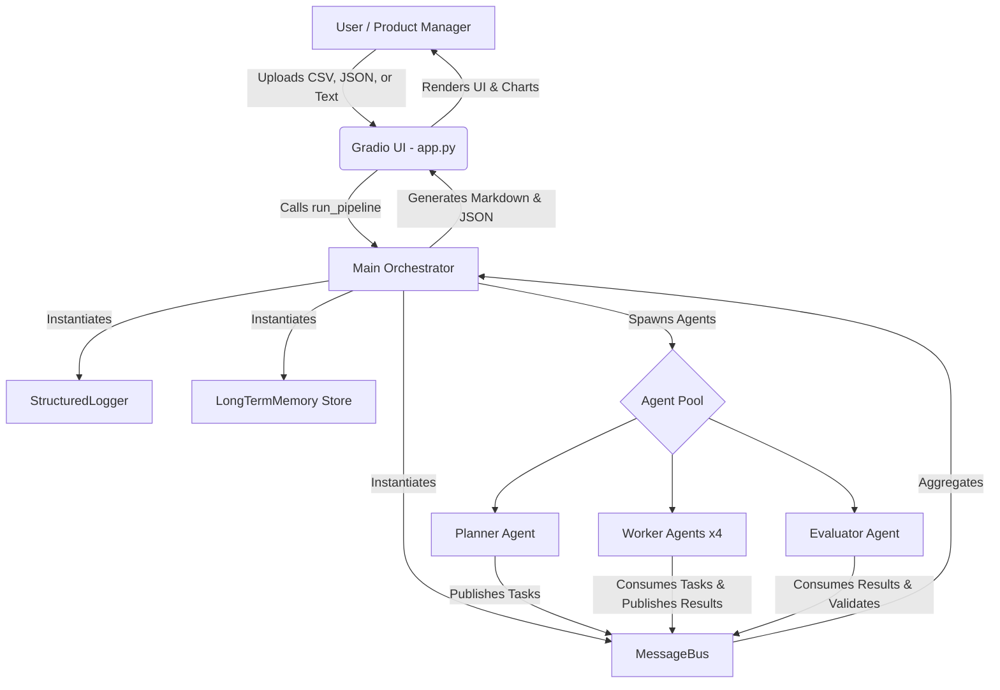
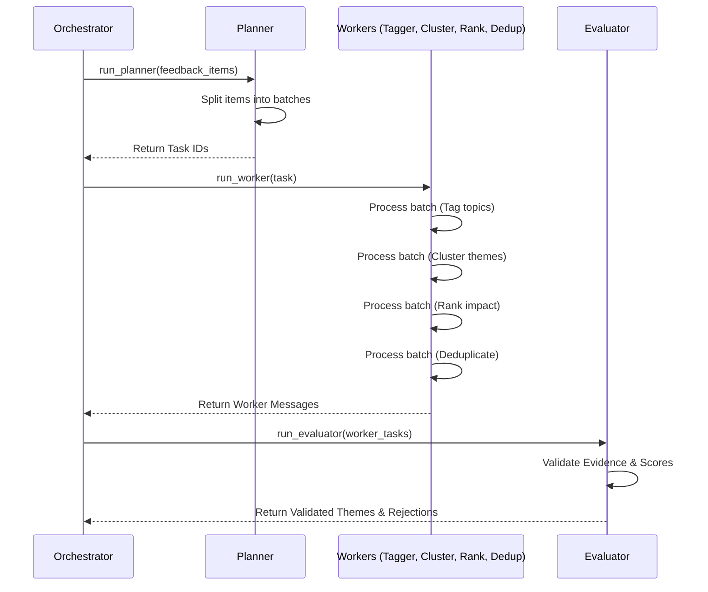
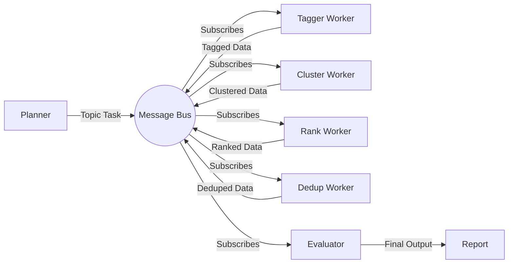

# Architecture Diagrams

## 1. System Architecture

```mermaid
graph TD
    A[User / Product Manager] -->|Uploads CSV, JSON, or Text| B(Gradio UI - app.py)
    B -->|Calls run_pipeline| C[Main Orchestrator]
    
    C -->|Instantiates| D[MessageBus]
    C -->|Instantiates| E[StructuredLogger]
    C -->|Instantiates| F[LongTermMemory Store]

    C -->|Spawns Agents| G{Agent Pool}
    G --> H[Planner Agent]
    G --> I[Worker Agents x4]
    G --> J[Evaluator Agent]

    H -->|Publishes Tasks| D
    I -->|Consumes Tasks & Publishes Results| D
    J -->|Consumes Results & Validates| D
    
    D -->|Aggregates| C
    C -->|Generates Markdown & JSON| B
    B -->|Renders UI & Charts| A
```

## 2. Multi-Agent Workflow

```mermaid
sequenceDiagram
    participant O as Orchestrator
    participant P as Planner
    participant W as Workers (Tagger, Cluster, Rank, Dedup)
    participant E as Evaluator
    
    O->>P: run_planner(feedback_items)
    P->>P: Split items into batches
    P-->>O: Return Task IDs
    
    O->>W: run_worker(task)
    W->>W: Process batch (Tag topics)
    W->>W: Process batch (Cluster themes)
    W->>W: Process batch (Rank impact)
    W->>W: Process batch (Deduplicate)
    W-->>O: Return Worker Messages
    
    O->>E: run_evaluator(worker_tasks)
    E->>E: Validate Evidence & Scores
    E-->>O: Return Validated Themes & Rejections
```

## 3. A2A Message Flow

```mermaid
graph LR
    P[Planner] -->|Topic Task| M((Message Bus))
    M -->|Subscribes| WT[Tagger Worker]
    WT -->|Tagged Data| M
    
    M -->|Subscribes| WC[Cluster Worker]
    WC -->|Clustered Data| M
    
    M -->|Subscribes| WR[Rank Worker]
    WR -->|Ranked Data| M
    
    M -->|Subscribes| WD[Dedup Worker]
    WD -->|Deduped Data| M
    
    M -->|Subscribes| E[Evaluator]
    E -->|Final Output| Output[Report]
```
